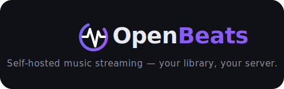

<p align="center">
  
</p>

<p align="center"><em>Self-hosted music streaming — your library, your server.</em></p>

---

OpenBeats is a self-hosted music streaming platform. Upload your audio library, stream it to any browser with full seek support — no cloud, no third-party services.

**Stack:** Go 1.23 · PostgreSQL · React + TypeScript · Docker / Kubernetes

## Quickstart

```bash
git clone https://github.com/jaydee94/openbeats.git
cd openbeats
make dev
```

| Service  | URL                   |
|----------|-----------------------|
| Web UI   | http://localhost:3000 |
| API      | http://localhost:8081 |

Default login: `admin` / `admin`

Stop the stack:

```bash
make stop
```

## Documentation

- [API Reference](docs/api.md)
- [Configuration](docs/configuration.md)
- [Deployment (Kubernetes / Helm)](docs/deployment.md)
- [Development Guide](docs/development.md)

## License

[MIT](./LICENSE)
